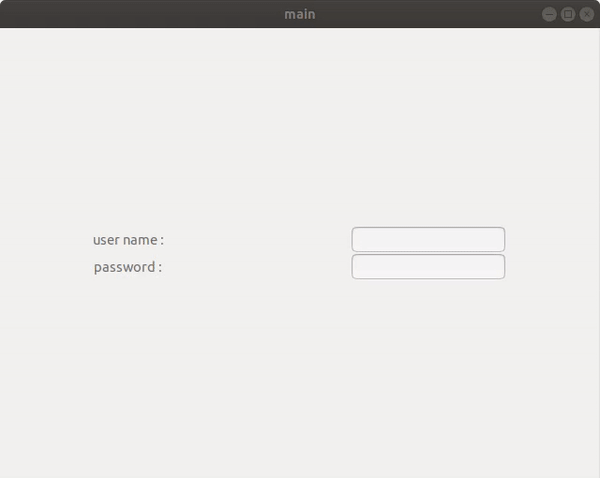

#### GTK ONSCREEN NUMERIC KEYPAD

Onscreen keypad are useful for developing application on Touch only devices like industrial HMI where no other input devices are attached to it

Features:

- Auto set Visibility to False when GtkEntry's purpose is GTK_INPUT_PURPOSE_PASSWORD
- highly modular can use it on any number of entry widgets on any screen
- Increment and decrements button

Compile and run the program using Following command:

gcc -rdynamic `pkg-config --cflags gtk+-3.0` -o main main.c keypad-num.c `pkg-config --libs gtk+-3.0`
